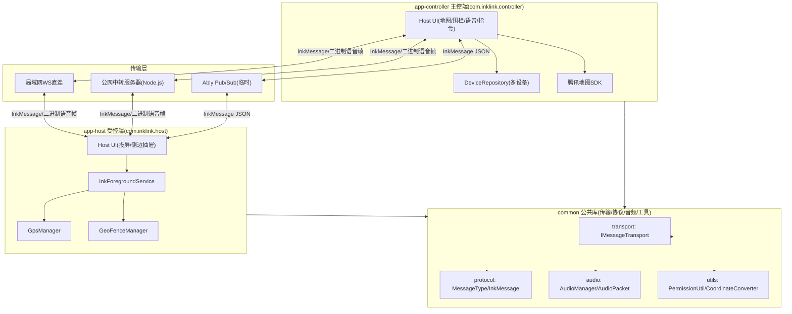

# InkLink 整体架构速查

> 目的：让 AI 与开发者快速理解全架构，编写或修改代码前先读本文，避免全项目逐文件通读。
> 变更代码时需同步更新本文。

## 1. 项目一句话

纯 Kotlin 安卓双端软件：受控端（手表/备用机）后台常驻，提供投屏显示、GPS 上报、围栏告警、语音对讲；主控端（主力手机）提供地图、围栏编辑、指令下发、语音对讲、告警接收，并可绑定多台受控端分别查看与管理。局域网 WS 直连、公网 WS 中转、Ably 公网中转（4G-4G 临时原型）三种传输均已实现，可切换。

## 2. 双端定义与角色

| 端 | 载体 | 网络角色 | 关键能力 |
|----|------|----------|----------|
| 受控端 app-host | 安卓手表/备用机 | 局域网 WS Server；公网 WS Client；Ably 订阅者 | 投屏显示、GPS、围栏、语音采播、前台保活 |
| 主控端 app-controller | 主力手机 | 局域网 WS Client；公网 WS Client；Ably 订阅者 | 地图、围栏编辑、多设备管理、指令、语音、告警接收 |

## 3. 技术栈与关键配置

- 语言：Kotlin 100%，无 Java 混编
- `minSdk 23`（Android 6.0），覆盖老旧设备与手表
- 工程结构：三 Module（common 公共库 + app-host 受控端 + app-controller 主控端），统一配置用 Version Catalog 单点控制
- 传输：Java-WebSocket（`org.java-websocket`）文本帧 + 二进制帧；Ably 使用 `io.ably:ably-android`（临时原型）
- 音频：原生 AudioRecord/AudioTrack，8000Hz/16bit/单声道，20ms 分片（320B/包），原生 `AcousticEchoCanceler` 消回声
- 地图：腾讯地图 SDK（仅 app-controller），GCJ-02 坐标系，Key+包名+SHA1 校验
- 坐标：`CoordinateConverter` 做 WGS-84（GPS 原生）↔ GCJ-02（腾讯地图）互转
- 定位：系统 `LocationManager`（原生，无需 play-services），围栏用 Haversine 距离计算
- 布局：ConstraintLayout + dp/sp，禁止固定 px，`DensityUtil` 适配
- 权限：Android 6.0 动态权限，`PermissionUtil` 统一管理，缺失降级

## 4. 模块与包结构

三 Module 依赖关系：`app-host` → `common` ← `app-controller`。common 不含 App 组件，复用传输、协议、音频、工具；腾讯地图 SDK 只进 app-controller。

```
├── common                          // Android Library（公共代码）
│   ├── transport                   // 传输层抽象：TransportMode、IMessageTransport、TransportManager
│   │   ├── LocalWsTransport        //   host 侧 WS Server / controller 侧 WS Client（指数退避重连）
│   │   ├── ServerRelayTransport    //   公网中转 WS Client（透传不解析，指数退避重连 + trustAll 开关）
│   │   ├── AblyRelayTransport      //   Ably Pub/Sub 广播频道（targetDeviceId 客户端过滤，临时原型）
│   │   ├── TransportManager        //   三模式切换、pending 消息缓存重放、默认目标设备、心跳透传
│   │   ├── SslTrustAll             //   仅测试用：信任所有证书
│   │   ├── TransportListener       //   文本/语音/连接状态回调
│   │   └── IMessageTransport       //   传输统一接口
│   ├── protocol                    // MessageType、InkMessage、MessageCodec（JSON 文本帧）
│   ├── audio                       // AudioManager（采播/AEC/静音/jitter）、AudioPacket（二进制组包）
│   ├── service
│   │   ├── gps                     //   GpsDetector、GpsManager、GpsReport（受控端定位上报）
│   │   ├── geofence                //   GeoFence、GeoFenceManager、GeofenceConfig、FenceEvent（Haversine + 去抖）
│   │   └── discovery               //   UdpDiscovery（局域网 UDP 广播设备发现）
│   └── utils
│       ├── PermissionUtil.kt       // 动态权限申请/判断/降级
│       ├── DensityUtil.kt          // dp/px、屏幕宽高、低分辨率/圆屏检测
│       ├── DeviceIdProvider.kt     // ANDROID_ID 优先 + UUID 持久化 fallback
│       ├── CoordinateConverter.kt  // WGS-84 ↔ GCJ-02 双向转换
│       ├── HeartbeatPolicy.kt      // 心跳自适应（亮屏 10s / 灭屏 30s）
│       ├── ImageUtil.kt            // 图片降采样压缩 + Base64 编解码
│       └── NetworkUtil.kt          // 本机局域网 IPv4 获取
├── app-host                        // Application，com.inklink.host，受控端
│   ├── service/InkForegroundService.kt // 前台服务，托管 GPS/围栏/语音/消息路由/UDP 应答
│   ├── state/HostScreenState.kt    // 共享状态（投屏内容/连接/日志，主线程回调）
│   ├── ui/HostActivity.kt          // 全屏投屏、二维码待机页、侧边抽屉、传输模式配置
│   └── receiver/BootReceiver.kt    // 开机自启前台服务
└── app-controller                  // Application，com.inklink.controller，主控端
    ├── InkControllerApplication.kt // 消息分发、多设备聚合路由、语音发起/挂断、告警通知、设备 CRUD
    ├── state/ControllerState.kt    // 共享状态（连接/多设备位置/选中目标/告警/通话）
    ├── data/DeviceEntity.kt        // 受控端设备条目（deviceId + 备注）
    ├── data/DeviceRepository.kt    // 设备列表本地持久化（SharedPreferences + JSON）
    ├── ui/ControllerActivity.kt    // 设备扫描/手动连接/控制面板/传输设置/设备管理入口
    ├── ui/DeviceManageActivity.kt  // 多设备管理：增删改、点选目标、在线状态
    ├── ui/MapActivity.kt           // 腾讯地图同时展示所有在线设备位置与告警
    ├── ui/FenceEditActivity.kt     // 地图打点 + SeekBar 半径，下发 GEOFENCE_CONFIG 到选中设备
    └── (腾讯地图 SDK 仅在此模块)
```

## 5. 架构图



## 6. 消息协议（勿改动编号）

```kotlin
enum class MessageType(val code: Int) {
    TEXT(1), IMAGE(2), GPS_REPORT(3), CMD_CLEAR(4),
    GEOFENCE_CONFIG(5), ALERT_ENTER(6), ALERT_EXIT(7),
    AUDIO_DATA(8), AUDIO_START(9), AUDIO_STOP(10),
    HEARTBEAT(99)
}
```

- `InkMessage(type, payload, audioData, targetDeviceId, fromDeviceId, address)`
- 文本/JSON 消息走 WebSocket 文本帧；语音走二进制帧（1 字节 type=8 + uint16 序号 + PCM）
- `audioData` 在文本帧中恒为 null；局域网/公网/Ably 共用同一协议，上层无感知
- 历史教训：原设计 `ALERT_EXIT(7)` 与 `AUDIO_DATA(7)` 冲突，已改语音类顺延为 8/9/10

## 7. 关键设计决策（改前先读）

1. **语音全双工**：双端同时采播，靠原生 AEC 消回声；硬件不支持时降级降噪并提示戴耳机
2. **传输抽象**：`IMessageTransport` 统一局域网/公网/Ably，上层业务不感知底层
3. **权限降级不变式**：无录音 → 语音隐藏；无定位 → GPS/围栏关闭；其余功能始终可用
4. **围栏去抖**：状态翻转需连续 2 次采样确认
5. **语音实时性优先**：丢包静音填充不重传；jitter buffer 约 100ms
6. **受控端保活**：前台服务 + 通知栏 + 白名单引导 + 心跳自适应（亮屏 10s/灭屏 30s）
7. **低内存降级**：`min(w,h)<480dp` 设备投屏图片自动降采样
8. **公网路由定向**：主控端设置 `defaultTargetDeviceId` 定向受控端；服务器带目标定向、无目标广播
9. **坐标转换**：受控端 GPS 为 WGS-84，腾讯地图为 GCJ-02；展示前 WGS-84→GCJ-02，下发围栏前 GCJ-02→WGS-84
10. **多设备管理**：主控端本地持久化设备列表（deviceId + 备注），地图按 `fromDeviceId` 聚合展示所有在线设备；围栏由各受控端独立维护
11. **Ably 临时中转**：4G-4G 原型，广播频道 + `targetDeviceId` 客户端过滤模拟点对点；甲骨文自建 WS 上线后整体移除

## 8. 开发顺序（里程碑）

T0 工程骨架（三 Module）→ T1 协议层 → T2 局域网 WS 文本投屏闭环 → T3 双端 UI+屏幕适配 → T4 动态权限 → T5 GPS+围栏 → T6 腾讯地图 → T7 语音对讲 → T8 保活+多机型测试 → T9 公网中转适配+发布 → T10 Ably 中转 + 坐标转换 + 多设备管理。详细任务见 `tasklist.md`。

## 9. 公网中转（三种模式）

- **局域网模式**：app-host 开 WS Server，app-controller 直连（默认）。
- **公网服务器模式**：双端都主动连接 WS 中转服务（`server/server.js`，Node.js + ws），服务器只做消息透传路由，不解包业务：
  - 文本帧带 `targetDeviceId` → 定向转发；不带 → 广播给其他已注册连接。
  - 语音二进制帧 → 按连接上最后见到的 `targetDeviceId`（`currentTarget`）转发。
  - 连接按 `fromDeviceId` 幂等 upsert 到 `deviceId ↔ WebSocket` 映射；服务端 ping 心跳清理僵尸连接；可选 `INKLINK_TOKEN` 鉴权。
- **Ably 模式（临时原型）**：双端用 `io.ably:ably-android` 订阅同一频道 `inklink-proto-ch01`，事件名 `ink-message`；频道为广播语义，`AblyRelayTransport` 按 `targetDeviceId` 客户端过滤（target 为空或等于本机 deviceId 才处理）。Ably Key 经 `local.properties` → `BuildConfig.ABLY_KEY` 注入，不硬编码。语音二进制本期搁置，只传文本 JSON。
- 设备 ID 用 `Settings.Secure.ANDROID_ID`（无效值时 UUID 持久化兜底）。
- 部署：Ubuntu + Node.js + ws 库（端口 8081），`server/nginx.conf.example` 做 WSS 加密（Let's Encrypt 证书）、`server/inklink-relay.service` 做 systemd 常驻；注意系统 ufw 与甲骨文云安全组双层放行。
- 完整方案见 `design.md` 的「公网服务器中转」与「Ably 中转」章节。

## 10. 相关文档

- 需求文档：`.monkeycode/specs/inklink-android-guide/requirements.md`
- 技术设计：`.monkeycode/specs/inklink-android-guide/design.md`
- 任务清单：`.monkeycode/specs/inklink-android-guide/tasklist.md`
