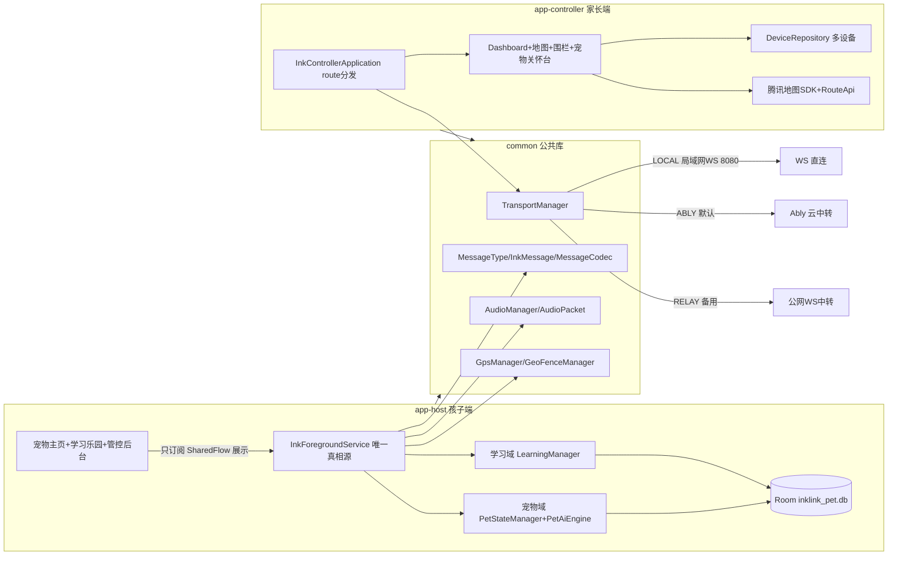
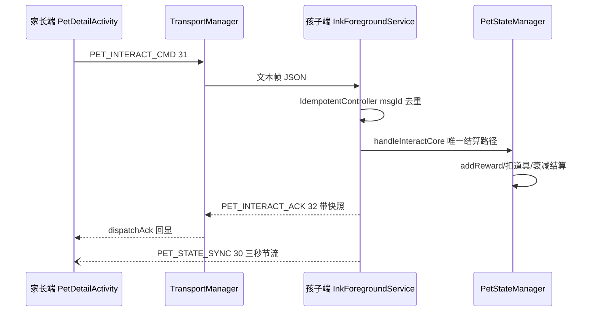

# InkLink 整体架构速查

> 目的：让 AI 与开发者快速理解全架构，编写或修改代码前先读本文，避免全项目逐文件通读。
> 变更代码时需同步更新本文。最近同步：2026-09-27（覆盖至提交 fd81b18，M2 全量原生交付后）。

## 1. 项目一句话

纯 Kotlin 安卓双端软件：孩子端（手表/备用机/平板）后台常驻，承载「电子宠物养成 + 幼小衔接学习乐园」，同时提供投屏显示、GPS 上报、围栏告警、语音对讲、聊天；家长端（主力手机）提供地图、围栏编辑、宠物远程关怀、作业与奖励下发（协议就绪、UI 待建）、语音对讲、告警接收，可绑定多台孩子端。局域网 WS 直连、Ably 公网中转（默认）两种传输可用，Relay 自建服务器中转客户端代码保留、服务端已删。

## 2. 双端定义与角色

| 端 | 模块 | 载体 | 网络角色 | 关键能力 |
|----|------|------|----------|----------|
| 孩子端（受控端） | app-host（com.inklink.host） | 安卓手表/备用机/平板 | 局域网 WS Server；Ably 订阅者（默认） | 宠物养成、学习乐园、投屏显示、GPS、围栏、语音采播、聊天、好友、前台保活 |
| 家长端（主控端） | app-controller（com.inklink.controller） | 主力手机 | 局域网 WS Client；Ably 订阅者（默认） | 设备管理、地图/轨迹/驾车路线、围栏编辑、宠物关怀控制台、强控指令、聊天、告警接收、学习简报 |

## 3. 技术栈与关键配置

- 语言：Kotlin 100%，无 Java 混编；JDK 17
- `minSdk 23`（Android 6.0），`compileSdk/targetSdk 34`，Gradle 8.5（仓库自带 wrapper）
- AGP 8.2.2 / Kotlin 1.9.24 / KSP 1.9.24-1.0.20，版本统一在 `gradle/libs.versions.toml`（Version Catalog 单点控制）
- 持久化：Room 2.6.1（仅 app-host，KSP 注解处理，`inklink_pet.db`）；app-controller 仅 SharedPreferences + Gson JSON
- 传输：Java-WebSocket 1.5.6（文本帧 + 二进制帧）；Ably `io.ably:ably-android:1.2.52`（默认公网模式）
- 音频：原生 AudioRecord/AudioTrack，8000Hz/16bit/单声道，20ms 分片（320B/包），原生 `AcousticEchoCanceler` 消回声，jitter buffer 约 5 帧
- 地图：腾讯地图 vector-sdk 6.13.0.260731（仅 app-controller），GCJ-02 坐标系；`CoordinateConverter` 做 WGS-84 ↔ GCJ-02 互转
- 定位：系统 `LocationManager` 双源融合（GPS + Network）+ 卡尔曼滤波（`KalmanLocationFilter`），围栏 Haversine 距离
- UI：View 体系（非 Compose），ConstraintLayout + dp/sp 禁固定 px，Material3 主题 `Theme.InkLink`；宠物渲染为自研部件化像素引擎 `PetSpriteView`（96x96 画布整数放大）
- 其他依赖：konfetti（礼花）、security-crypto（EncryptedSharedPreferences 存 PIN 哈希）、zxing（host 生成二维码 / controller 扫码）、dynamicanimation
- 仓库源：阿里云镜像 + 腾讯 maven 源（`mirrors.tencent.com`，settings.gradle.kts 已配置）
- 密钥不入库：`ABLY_KEY`/`TENCENT_MAP_KEY`/`TENCENT_MAP_SK` 从 `local.properties` 或 CI 环境变量注入 BuildConfig/manifestPlaceholders

## 4. 模块与包结构

三模块依赖：`app-host` → `common` ← `app-controller`。common 不含 App 组件，承载协议/传输/音频/定位/工具；腾讯地图 SDK 只进 app-controller。

```
├── common                          // Android Library（公共代码）
│   ├── protocol                    // MessageType(52+99码位)、InkMessage、MessageCodec(Gson JSON)
│   │   └── payload                 // 9 组载荷：Pet/PetBag、Learn、Sound(SoundProtocol白名单)、Ack、Alert 等
│   ├── transport                   // IMessageTransport 统一抽象 + TransportManager(切换/pending重放)
│   │   ├── LocalWsTransport        //   host 侧 WS Server(8080) / controller 侧 Client(指数退避重连)
│   │   ├── ServerRelayTransport    //   公网中转 Client（服务端已删，代码保留）
│   │   └── AblyRelayTransport      //   Ably Pub/Sub（默认；主频道+好友频道{33,34,43}白名单）
│   ├── audio                       // AudioManager(采播/AEC/静音检测/jitter)、AudioPacket(3字节头二进制帧)
│   ├── chat                        // ChatStore(内存)、VoiceRecorder/VoicePlayer(AMR_NB)
│   ├── service
│   │   ├── gps                     // GpsDetector/GpsManager(双源+卡尔曼)/GpsReport(WGS-84)
│   │   ├── geofence                // GeoFence/GeoFenceManager(Haversine + 连续2次确认去抖)
│   │   └── discovery               // UdpDiscovery(端口9000，INKLINK_DISCOVER/INKLINK_REPLY)
│   └── utils                       // PermissionUtil、DensityUtil、DeviceIdProvider、CoordinateConverter、
│                                   // HeartbeatPolicy(10s/30s)、MonoClock/MonoThrottle、IdempotentController、
│                                   // ImageUtil、NetworkUtil、ReportThrottler(8m/3s)
├── app-host                        // Application，孩子端（宠物+学习+管控三合一）
│   ├── service/InkForegroundService.kt // 1216行，全业务唯一真相源：消息路由/GPS/围栏/语音/响铃/任务队列/宠物结算
│   ├── state                       // PetStateManager(979行状态机)/PetDecayEngine/PetClock/PetCatalog/
│   │                               // PetArcadeMap/PetSceneMap/GpsTreasureHunter/HostScreenState
│   ├── pet/PetAiEngine             // 行为树：8-20s随机空闲决策（虚弱>睡眠>抱怨>性格动作>待机）
│   ├── learning/LearningManager    // 495行单例：出题/结算/落库/上报47，艾宾浩斯+护眼+金币上限
│   ├── data                        // Room：PetDatabase v2(inklink_pet.db) pet_bag/event_log/learn_progress/
│   │                               // wrong_book/daily_stats；PetDao/LearnDao
│   ├── game/PetMiniGameManager     // 猜拳/翻牌/转盘判定 + 每日前8局防刷
│   ├── friend                      // FriendRepository(好友落盘)/GameInviteSession(远程对战)
│   ├── task/queue                  // TaskQueueManager(task_list.json上限20)/OfflineEventQueue(50条FIFO)
│   ├── tts/audio                   // LocalTtsManager(中英多引擎)/PetTtsGate(单例门控)/RawSoundPlayer(10wav)
│   ├── security                    // PinSecurityManager(EncryptedSP加盐哈希/5错锁2min/HMAC防重放)
│   ├── ui                          // PetMainActivity(2212行Launcher)/HostActivity(家长管控后台)/Chat/Friend
│   ├── ui.learning                 // LearningHub/Hanzi/Pinyin/Poem/Math/RestScreen/WrongBook/SchulteGrid
│   ├── ui.view                     // PetSpriteView(1519行像素引擎)/PixelSpecies/PixelProgressBarView/SpinWheelView
│   └── receiver                    // BootReceiver(开机自启)/AlarmReceiver(60s自愈)/PetWakeupReceiver(4h促活)
└── app-controller                  // Application，家长端（无 Service/Room，逻辑寄生于 Application 进程）
    ├── InkControllerApplication    // 473行：消息route()分发、多设备聚合、语音发起/挂断、告警通知
    ├── state/ControllerState       // 多设备位置/轨迹(500点)/状态/学习简报(仅内存)
    ├── care/CareMonitor            // 离线30min提醒/连续在线2h休息提醒（60s评估，冷却30min）
    ├── data                        // DeviceEntity/DeviceRepository(SharedPreferences+JSON)
    ├── service/RouteApi            // 腾讯驾车路线 WebService（SK MD5签名 + polyline解压）
    ├── audio/AudioSettings         // 主控端TTS播报开关
    └── ui                          // ControllerActivity(Dashboard)/MapActivity/FenceEditActivity/
                                    // DeviceManageActivity/PetDetailActivity(宠物关怀台)/ChatActivity
```

## 5. 架构图



关键消息流（家长下发宠物互动为例）：



## 6. 三大业务子系统

### 6.1 管控安全（基底能力，common + 双端 UI）

- **投屏**：TEXT/IMAGE/CMD_CLEAR，图片 ImageUtil 降采样 Base64（封顶 60000 字符适配 64KB），低内存设备（min(w,h)<480dp）自动再降采样；深度刷新 19 + 画面缓存自愈 20。
- **GPS**：GpsManager 双源融合 + 卡尔曼，质量分级 HIGH/MEDIUM/LOW；ReportThrottler 位移>8m 或 >3s 才上报；REQUEST_GPS(11) 单次定位。
- **围栏**：FenceEditActivity 地图选点（GCJ-02→WGS-84 反变换后下发 GEOFENCE_CONFIG(5)）；GeoFenceManager 状态翻转需连续 2 次采样确认；Enter/Exit 触发 6/7 告警 + PET_ALERT_EVENT(35) 宠物受惊。
- **语音对讲**：AUDIO_START/STOP(9/10)，8000Hz 20ms 分帧，二进制帧 `[type=8][uint16序号LE][PCM]`；忙线拒接 REASON_BUSY。
- **强控**：CMD_RING(16) 走 SirenManager STREAM_ALARM + 脉冲震动，msgId 幂等；PUSH_ALERT(21)；CMD_RESET_HOST_PIN(36) 需 HMAC-SHA256 签名 + ±60s 防重放。
- **聊天**：CHAT_TEXT/IMAGE/AUDIO(12-14)，语音 AMR_NB 12.2kbps 适配 64KB 文本帧；ChatStore 仅内存。
- **心跳**：PING(50) 30s 一发 / PONG(51) 应答，45s 未收到判离线；HeartbeatPolicy 亮屏 10s/灭屏 30s；HEARTBEAT(99) 为局域网极简保活。
- **保活**：前台服务（Android 14+ 动态组合 foregroundServiceType）+ START_STICKY + AlarmManager 60s 自愈 + BootReceiver 开机自启 + PetWakeupReceiver 4h 促活 + 电池白名单引导；指令到达抢 2s WakeLock。

### 6.2 宠物游戏化（app-host 为主，家长端 PetDetailActivity 远程）

- **状态机**：`PetStateManager` 进程级单例（companion cachedBag + 全局锁），整包 PetBag JSON 存 Room `pet_bag` 单行，10s 节流落盘 + onPause flush。四维（hunger/happiness/energy/clean）+ health + exp/level + 性格（playfulness/affection）。
- **成长**：升级经验 = level*100；CUB(≤1)→JUVENILE(2)→ADOLESCENT(4)→ADULT(5+)，成年按行为定型 finalForm（学习多 STUDIOUS / playfulness≥30 PLAYFUL / health<50 DROOPY / 否则 BALANCED）。
- **衰减**：`PetDecayEngine` 双时钟（前台 PetClock.foreground 由 onResume/onPause 翻转）+ 分属性浮点余量模型防丢帧；前台佛系（饱食 16h/开心 23h/精力 20h/清洁 32h 掉光），后台自动休眠四维豁免、精力/健康 ÷20 恢复；hunger<20 或 clean<20 时 health 每 90s -1。
- **生命闭环 V1.2**：health=0 → 虚弱沉睡（可 heal 复活）；超 24h 宽限 → 离世归档 Memorial 纪念册；rebirth() 全新宠物资产归零、纪念册保留。
- **经济**：金币入账唯一入口 `PetStateManager.addReward(coin, exp, reason)`；消耗=商店（7 道具/21 物种/4 装饰/3 场景，cat 初始免费、最贵 270 币）；每日目标（喂2玩1洗1）奖 60 币；小游戏每日前 8 局有奖；随机事件 60s roll（55% 正向）；GPS 寻宝（80m 位移+60s 冷却）。
- **互动**：六动作（feed/playWith/learn/cleanPet/toggleSleep/heal）+ 手势（touch/longPress/annoy）；远程 31/23 指令共用 `handleInteractCore` 防双扣；Buff（energy/mood）即时改值 + 对应属性 10 分钟暂停衰减。
- **表现层**：`PetSpriteView` 部件化像素引擎（96x96，三级回退：PIXEL_PNG → arcade 帧图 → 程序化像素）；`PetAiEngine` 行为树 8-20s 决策；音效三级隔离（RawSoundPlayer 预制 wav / SoundEffectManager chiptune 合成 / SirenManager 告警）；TTS 走 PetTtsGate 进程单例门控。

### 6.3 学习乐园（app-host 原生，家长端简报只读）

- **模块**：识字屋 HANZI / 拼音森林 PINYIN / 口算商店 MATH / 古诗亭 POEM / 复习谷 REVIEW / 专注力 FOCUS（舒尔特方格）；英语 ENGLISH 建设中。全部原生 Activity（WebView 链路已在 M2 退役）。
- **唯一入口**：`LearningManager` 单例——出题选字、结算（唯一走 addReward）、进度/错题/日统计落库、LEARN_PROGRESS(47) 上报。UI 不直接写三张学习表。
- **艾宾浩斯**：答对 reviewStage+1，`nextReviewTs = now + [1,2,4,7,15][stage] 天`；走满 5 级 MASTERED；答错回 stage 0 并写 wrong_book。
- **护眼防沉迷**（`SystemClock.elapsedRealtime` 计时防改钟）：连续 20 分钟强制休息页 5 分钟（back 键吞掉）；每日 40 分钟上限（可家长调整，当前为固定值）；21:00-6:00 夜禁；金币日上限 150。
- **资产**：`assets/learning/` 6 个 JSON（hanzi 3024 字 / poems 114 首 / pinyin 474 音节+250 配对题 / english 2 个未接线）；由 `tools/learning/build_learning_assets.py` 从 3 个参考仓库生成。
- **家长侧现状**：47 码 → `ControllerState.learnSummaryByDevice` 内存一行简报（Dashboard 展示）；48/49 作业载荷协议已定义、主控端零消费（M3 待开发）。

## 7. 消息协议（勿改动编号）

完整 52+99 码位表与载荷字段见 `INTERFACES.md`。分组速览：

| 码位 | 分组 |
|------|------|
| 1-21 | 基础管控（投屏/GPS/围栏/语音/聊天/响铃/状态/告警） |
| 22/23 | 音频扩展（通用提示音/宠物事件音） |
| 30-36 | 宠物核心（状态同步/互动/对战/受惊/PIN重置） |
| 40-44 | 背包商店（全量同步/切换/购买/串门/远程赠礼） |
| 45/46 | 远程语音任务（下发/回执） |
| 47-49 | 学习扩展（进度/作业下发/作业回执） |
| 50-52 | 心跳（PING/PONG/错误回执） |
| 99 | HEARTBEAT 极简保活 |

- `InkMessage(type, payload, audioData, targetDeviceId, fromDeviceId, address, msgId, timestamp)`，文本帧 Gson JSON、强制剥离 audioData；语音走 3 字节头二进制帧。
- 历史教训：`ALERT_EXIT(7)` 曾与音频冲突已顺延；`10/11/12` 被基础协议占用后宠物心跳改用 `50/51/52`；enum 重复码位会使 fromCode 静默覆盖。
- Ably 好友频道白名单 {33,34,43}——「只游戏、不控制」；47-49 只走主控频道。

## 8. 数据持久化

| 端 | 存储 | 内容 |
|----|------|------|
| app-host | Room `inklink_pet.db`（v2，允许主线程查询 + 破坏性迁移） | pet_bag(整包JSON单行)、event_log(环形500)、learn_progress(主键 module+itemId)、wrong_book、daily_stats(主键 date+module) |
| app-host | JSON 文件 | friends.json、task_list.json(上限20)、offline_events.json(上限50) |
| app-host | EncryptedSharedPreferences | PIN 加盐哈希、锁定时间戳 |
| app-controller | SharedPreferences | inklink_devices(设备列表JSON)、inklink_controller(pairingKey/ablyKey/TTS开关) |
| app-controller | 无 Room | 学习简报仅内存，清 App 即失（与宠物数据同命，见 IMPLEMENTATION_PLAN 风险项） |

## 9. 关键设计决策（改前先读）

1. **单一真相源**：`InkForegroundService` 为全业务真相源，UI 只订阅 MutableSharedFlow 展示，禁止 UI 直接改业务数据。
2. **奖励唯一入口**：所有学习/游戏/寻宝奖励只走 `PetStateManager.addReward`，保证升级/日志/礼花一致触发。
3. **防双扣**：远程 31/23 互动共用 `handleInteractCore` 唯一结算路径；msgId 幂等去重（LRU 50 + TTL 60s）。
4. **传输抽象**：三模式同构 `IMessageTransport`，TransportManager 互斥切换 + pending 文本队列断线重放（语音帧不缓存，实时性优先）。
5. **零信任校验**：互动 count 强制 [1,5]、数值 coerceIn(0,100)、TTS 文本 sanitizeTts 码点边界裁剪、TTS_TEXT_MAX_LEN 40 / TASK_TTS_MAX_LEN 120。
6. **音频通道隔离**：宠物音效/TTS 绑 STREAM_MUSIC，告警绑 STREAM_ALARM 并强行打断 TTS；来电暂停恢复。
7. **权限降级不变式**：无录音→语音隐藏；无定位→GPS/围栏关闭；其余功能始终可用。
8. **双时钟防作弊**：学习计时与宠物衰减均基于 elapsedRealtime/MonoClock，墙钟回拨不卡冷却（MonoThrottle/IdempotentController 有回归测试钉死）。
9. **围栏去抖**：状态翻转需连续 2 次采样确认。
10. **坐标转换**：GPS 上报 WGS-84 原始系；地图展示前转 GCJ-02，下发围栏前反变换回 WGS-84。
11. **零服务器硬约束**：学习内容/字体/音频全离线内置 APK；Ably 为免运维第三方 SaaS；腾讯地图/驾车路线为仅在线功能（断网灰置）；原自建 server/ 已删除。
12. **密钥不入库**：local.properties 或 CI Secrets 注入 BuildConfig，manifest 占位符 `${TENCENT_MAP_KEY}`。
13. **多设备管理**：主控端设备列表 SharedPreferences 持久化；地图按 fromDeviceId 聚合；围栏各受控端独立维护。
14. **契约测试护资产**：PNG/WAV 素材有命名闭集/尺寸/格式/质心契约测试，改素材先跑单测。

## 10. 里程碑进度（2026-09-26 口径，来源 docs/IMPLEMENTATION_PLAN.md）

| 里程碑 | 内容 | 状态 |
|--------|------|------|
| M1 | 资产管线 + 识字屋 + 协议 47 + 家长简报 | 已交付 |
| M2 | 拼音森林/口算商店/古诗亭/复习谷/错题本/护眼防沉迷/舒尔特方格（三岛全原生，WebView 退役） | 已交付 |
| M3 | 家长作业布置(48/49 UI)/学习报告页/习惯打卡/英语字母岛(26字母卡+191词闪卡) | 未开工 |
| 后置 | 笔顺描红(hanzi-writer 已删待后置)/绘本/自然拼读/儿歌/圆屏适配 | 未开工 |

## 11. 测试与 CI

- 单测分布：common 9 类（协议往返/SoundProtocol 契约/围栏去抖/坐标转换/幂等/单调节流）、app-host 6 类（衰减引擎/游戏化内核/生命闭环/精灵资产契约/街机资产契约/音效契约）、app-controller 2 类（状态聚合/设备仓库）。
- 盲区：learning 包、InkForegroundService 路由、security/friend/task/queue 无单测。
- CI（`.github/workflows/android.yml`）：push master/main 触发，JDK 17 temurin，先 `:app-host:testDebugUnitTest` 门禁再 `assembleRelease`，产物为未签名 APK 发布到 GitHub Release（tag `v1.2.0-<run_number>`）；密钥经 GitHub Secrets 注入。
- 注意：app-controller 的单测不在 CI 门禁内（见 CHECKLIST_PET_AUDIO「故意不做」项）。

## 12. 相关文档

- 接口与协议明细：`.monkeycode/docs/INTERFACES.md`
- 开发者指南（环境/构建/常见任务）：`.monkeycode/docs/DEVELOPER_GUIDE.md`
- 文档索引：`.monkeycode/docs/INDEX.md`
- 实现规则与功能清单（进度唯一口径）：`docs/IMPLEMENTATION_PLAN.md`
- 宠物基准规范：`.monkeycode/specs/pet-system/design.md`
- 需求/设计/任务清单：`.monkeycode/specs/inklink-android-guide/`
- 素材验收：`CHECKLIST_PET_AUDIO.md`、`CHECKLIST_PET_SPRITE.md`
