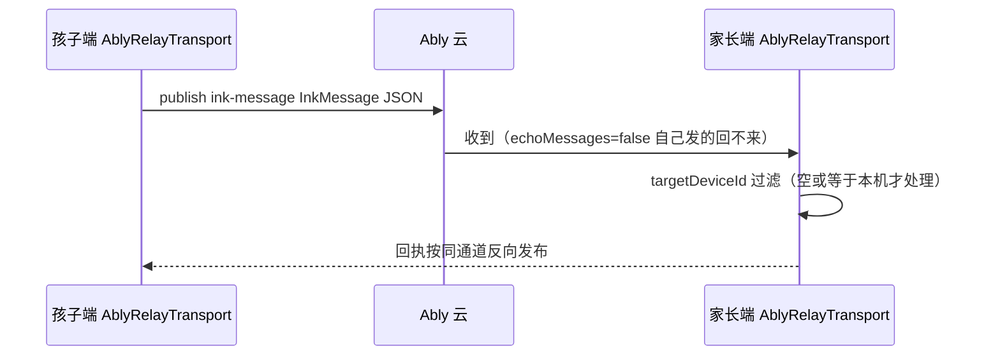

# 传输三模式（LOCAL / RELAY / ABLY）

双端通信的传输层抽象：三种底层通道同构实现 `IMessageTransport`，上层业务完全无感知，由 `TransportManager` 统一切换、缓存与重放。

## 概念定义

- **LOCAL 局域网直连**：孩子端起 WebSocket Server（8080），家长端作为 Client 直连 `ws://ip:port`。零云依赖，配网靠 UdpDiscovery（9000）广播发现 + 二维码（`ws://ip:port`）。
- **RELAY 公网中转**：双端均作为 Client 连自建 Node.js WS 中转服务器。服务端已随「零服务器」决策删除（原 server/server.js），客户端代码保留可随时复用。
- **ABLY 公网中转（默认）**：双端订阅 Ably Pub/Sub 频道，广播语义 + targetDeviceId 客户端过滤模拟点对点。免运维第三方 SaaS，主控端启动即 connectAbly()。

## 代码位置

| 方面 | 位置 |
|------|------|
| 接口与模式 | common/.../transport/IMessageTransport.kt、TransportMode.kt |
| 管理器 | common/.../transport/TransportManager.kt（切换/pending重放/64KB校验） |
| 局域网 | common/.../transport/LocalWsTransport.kt |
| 中转 | common/.../transport/ServerRelayTransport.kt |
| Ably | common/.../transport/AblyRelayTransport.kt |
| 发现 | common/.../service/discovery/UdpDiscovery.kt |
| 心跳策略 | common/.../utils/HeartbeatPolicy.kt |

## 三模式参数对照

| 项 | LOCAL | RELAY | ABLY |
|----|-------|-------|------|
| 默认端口/频道 | WS 8080 | serverUrl 指定 | 主频道 `inklink-proto-ch01`，好友频道 `inklink-pet-${pairingKey}` |
| 心跳 | 15s（HeartbeatPolicy 亮屏 10s/灭屏 30s 覆盖） | 15s | 15s |
| 重连退避 | 1s shl attempt（上限 5）封顶 30s | 1s shl attempt（上限 10）+ 0-50% jitter 封顶 60s | Ably SDK 自带 |
| 语音二进制帧 | 支持 | 支持 | 空实现（只传文本 JSON） |
| 定向 | targetDeviceId 单播 | 服务器按 target/from 路由 | target 非空且不等于本机则丢弃；空=广播放行 |
| 依赖 | 同一局域网 | 自建服务器（已删） | Ably Key（BuildConfig.ABLY_KEY 或 prefs） |

## 关键机制

### 消息流（Ably 模式）

### pending 重放

发送时未连接：文本消息进 ArrayDeque 缓存；任一传输 onConnectionChanged(true) 时按 FIFO 全部重发。**语音帧不缓存**（实时性优先，直接丢弃）。

### 切换语义

`switchMode` 先判 sameTarget（同模式同 host/port/url/channel 直接 return）；切换时先 disconnect 旧实例再建新实例，避免双连接乱序。

### 好友频道白名单

Ably 好友频道（`inklink-pet-${pairingKey}`）只放行 {PET_GAME_INVITE(33), PET_GAME_ACTION(34), PET_BAG_INTERACT(43)}——「只游戏、不控制」。主频道全量放行。新增好友互动码位必须显式更新白名单。

### 幂等与去重

- Ably 消息 id 设为 InkMessage.msgId，开启 Ably 服务端幂等去重
- 受控端业务层用 IdempotentController（LRU 50 + TTL 60s）按 msgId 去重；时钟回拨已钉回归测试
- 连接注册：RELAY 模式连接建立即发 HEARTBEAT(99) 上报 deviceId；LOCAL 模式 client 连上即发一条 HEARTBEAT

## 设备发现协议（UdpDiscovery）

- 端口 9000，扫描窗口 2s
- 主控端广播 UTF-8 文本 `INKLINK_DISCOVER` 到 255.255.255.255
- 孩子端应答 `INKLINK_REPLY:` + JSON `{"deviceId":"...","wsPort":8080}`

## 开发注意事项

1. 设备 ID：ANDROID_ID 优先（含无效值 9774d56d682e549c 检测），UUID 持久化兜底（DeviceIdProvider）
2. Ably 连接状态枚举是 `io.ably.lib.realtime.ConnectionState`（非 types 包，历史踩坑）
3. 单条消息 64KB 硬上限（MAX_MESSAGE_BYTES），TransportManager 发送前校验超限丢弃；图片/聊天语音靠 ImageUtil/AMR 压缩适配
4. pairingKey 默认 `inklink_default_key`，家长端存 prefs（inklink_controller），好友频道与远程 PIN 重置 HMAC 共用此钥匙
5. 新传输实现必须：文本走 dispatchText 回调、二进制帧直接回调 onAudioMessage、心跳间隔支持 provider 覆盖
