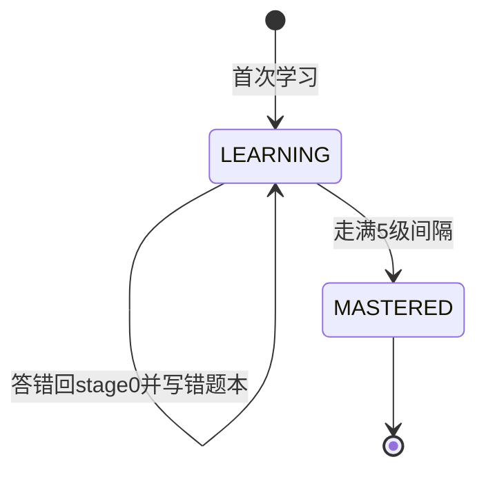

# 学习乐园（幼小衔接课程与艾宾浩斯复习）

学习乐园是 M1/M2 交付的教学子系统：孩子按岛学习识字/拼音/口算/古诗，系统自动调度复习、护眼防沉迷，并将进度上报家长端。

## 概念定义

**岛（module）**：一个学习科目域。当前枚举：HANZI 识字屋 / PINYIN 拼音森林 / MATH 口算商店 / POEM 古诗亭 / REVIEW 复习谷 / FOCUS 舒尔特方格 / ENGLISH 建设中。

**LearningManager**：学习系统唯一业务入口的单例。职责四件事——出题选字、结算入账（唯一走 PetStateManager.addReward）、进度/错题/日统计落库、LEARN_PROGRESS(47) 上报。UI 不直接写学习三表。

**艾宾浩斯复习**：每个学习项维护 reviewStage，答对升级、答错归零；到期项进「复习谷」优先复习。

## 代码位置

| 方面 | 位置 |
|------|------|
| 业务单例 | app-host/.../learning/LearningManager.kt |
| 大厅 | app-host/.../ui/learning/LearningHubActivity.kt（guardPass 统一拦截） |
| 识字屋 | ui/learning/HanziActivity.kt（5 认读卡 + 5 听音选字） |
| 拼音森林 | ui/learning/PinyinActivity.kt（6 字母卡 + 4 声调配对，TTS 代表字代偿 proxyCharFor） |
| 口算商店 | ui/learning/MathActivity.kt（一关 10 题，生成器在 LearningManager.generateMathQuestions） |
| 古诗亭 | ui/learning/PoemActivity.kt（TTS 朗读 + 挖空四选一） |
| 休息页 | ui/learning/RestScreenActivity.kt（5 分钟强制，back 键吞掉） |
| 错题本 | ui/learning/WrongBookActivity.kt |
| 舒尔特方格 | ui/learning/SchulteGridActivity.kt（5x5 计时，入 FOCUS 模块） |
| 持久化 | app-host/.../data/LearnEntities.kt + LearnDao.kt（PetDatabase v2） |

## 数据表

| 表 | 主键 | 字段 | 用途 |
|----|------|------|------|
| learn_progress | (module, itemId) | status(LEARNING/MASTERED)/correctCount/wrongCount/lastTs/reviewStage/nextReviewTs/level | 艾宾浩斯调度主表 |
| wrong_book | id 自增 | module/itemId/payloadJson/wrongTs/resolvedTs（索引 module/resolvedTs） | 错题记录 |
| daily_stats | (date, module) | minutes/itemsDone/correctSum/coinsEarned/expEarned | 日统计；金币日上限用跨模块 SUM 核算 |

## 出题规则

- 识字：每关 5 字；优先插 2 个到期复习字，余位取本级未学字；干扰字取同级字库
- 拼音：6 张字母卡（声母/韵母/整体认读混抽）+ 4 道声调配对；声母/韵母无整字发音，TTS 借代表字代读（b→播「波」）
- 口算：L1=5 以内加减；L2=10 以内加减+分与合+比大小；L3=20 以内进退位+数列；干扰项 ±2 抖动
- 古诗：本级抽 3 首，随机句挖一字四选一，干扰字池取诗内字

## 艾宾浩斯生命周期

- 间隔表：`REVIEW_INTERVAL_DAYS = [1, 2, 4, 7, 15]`（天）
- 答对：`nextReviewTs = now + 间隔[stage]`；答错：回 stage 0、次日复审、写 wrong_book
- 复习奖励：金币 0.5x、经验 2x（引导复习优先）
- `dueSummary()` 汇总三模块到期数，复习谷入口展示

## 护眼防沉迷（硬规则）

| 规则 | 值 | 实现 |
|------|-----|------|
| 连续学习 | 20 分钟 → 强制休息页 5 分钟 | startSession 用 `SystemClock.elapsedRealtime()` 计时，防改系统时间绕过 |
| 每日总时长 | 40 分钟 | daily_stats.minutes 跨模块累计，到限学习入口置灰（宠物页/聊天保留） |
| 夜间禁用 | 21:00-6:00 | guardBlock 返回 NIGHT，入口弹窗 |
| 金币日上限 | 150 币 | 结算时 coerceAtMost(allowance) 截断，超限关卡照玩金币不发 |

guardBlock 阻断优先级：NIGHT → CAP → REST；REST 直接跳 RestScreenActivity。

## 与家长端联动

- 每次结算后 `reportProgress` 发 47 号（scope=LESSON + 每日 DAILY 双粒度，含 correctRate/minutesToday/coinsToday/weakTop5）
- 家长端目前仅落内存 `ControllerState.learnSummaryByDevice` 展示一行简报
- 48/49 作业协议已定义、主控端未实现（M3 开发项，见 DEVELOPER_GUIDE 已知坑）

## 资产

`app-host/src/main/assets/learning/` 共 6 个 JSON（380KB）：

| 文件 | 规模 | 状态 |
|------|------|------|
| hanzi.json | 3024 字（char/pinyin/phrase/sentence/level L1-L4） | 在用 |
| poems.json | 114 首 | 在用 |
| pinyin.json | 474 音节（声母23/韵母24/整体认读/常用音节） | 在用 |
| pinyin_questions.json | 250 道声调配对题 | 在用 |
| english_words.json | 191 词 | 未接线（英语岛建设中） |
| english_sentences.json | 109 句型 | 未接线 |

重生成：`python tools/learning/build_learning_assets.py`（依赖 3 个参考仓库，注意剔除脚本重新生成的已退役 lib/ 目录）。

## 历史决策记录

- M1 曾用 WebView 嵌 hanzi-study + JSBridge；M2 重构为全原生 Activity 并退役 WebView 链路（提交 d997aa1），笔顺描红（hanzi-writer）随之后置
- 学习结算的奖惩口径（正确率系数、刷关递减）以 docs/IMPLEMENTATION_PLAN.md 第 6 节为准
