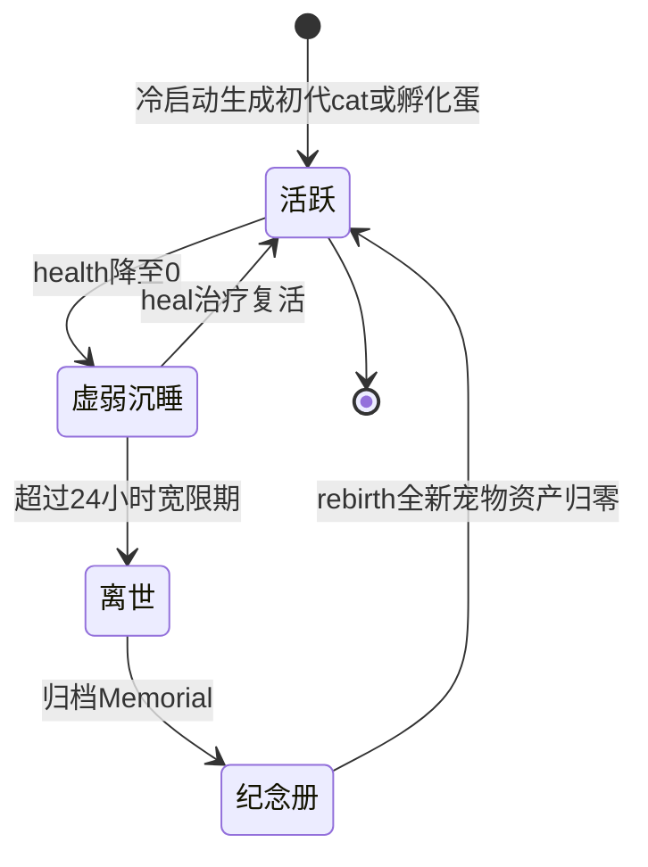

# 宠物系统（PetBag 与宠物生命周期）

宠物系统是孩子端的核心激励引擎：孩子通过学习、互动、寻宝赚金币养宠物，宠物状态变化反向驱动 UI 与家长端同步。

## 概念定义

**PetBag** 是孩子端全部宠物资产的单例聚合根：活跃宠物 + 休眠宠物列表 + 金币 + 道具库存 + 成长时间线 moments + 纪念册 memorials。整包 Gson 序列化后存 Room `pet_bag` 表单行。

**PetItem** 是单只宠物的全量状态（31 字段）：四维需求（hunger/happiness/energy/clean）+ health + exp/level/lifeStage + 性格（playfulness/affection）+ finalForm + 外观（decoId/sceneId）+ 浮点余量 remXxx（衰减防丢帧）+ passedAtTs。

**关键特征**:
- 进程级单例语义：companion cachedBag + 全局锁，Service/UI/Receiver 共享同一内存态
- 10s 节流落盘 + 关键节点 persist(force) + onPause flush
- 唯一真相源在后台（InkForegroundService），UI 只读快照

## 代码位置

| 方面 | 位置 |
|------|------|
| 状态机 | app-host/.../state/PetStateManager.kt |
| 衰减引擎 | app-host/.../state/PetDecayEngine.kt |
| 时钟 | app-host/.../state/PetClock.kt（双时钟） |
| 商品目录 | app-host/.../state/PetCatalog.kt（唯一数据源） |
| 行为树 | app-host/.../pet/PetAiEngine.kt |
| 渲染 | app-host/.../ui/view/PetSpriteView.kt + PixelSpecies.kt |
| 持久化 | app-host/.../data/PetEntities.kt + PetDao.kt |
| 远程入口 | app-host/.../service/InkForegroundService.kt handleInteractCore |
| 家长端 | app-controller/.../ui/PetDetailActivity.kt |

## 核心规则（不变量）

1. **奖励唯一入口**：一切金币/经验只走 `addReward(coin, exp, reason)`，联动升级/事件日志/礼花。
2. **防双扣**：远程 31（互动）与 23（事件）汇入同一条结算路径 handleInteractCore。
3. **衰减不丢帧**：分属性浮点余量模型，`owed = rem + rate*budget` 兑现整数点；settle 幂等。
4. **切换先结算**：切换 activePetId 前先对旧宠做时间差衰减落盘，防数值跳跃。
5. **数值边界**：四维 coerceIn(0,100)；远程互动 count 强制 [1,5]。

## 成长与衰减

- 升级经验：level * 100，可连升
- 生命阶段：CUB(等级≤1) → JUVENILE(2) → ADOLESCENT(4) → ADULT(5+)；成年按行为定型 finalForm（学习多 STUDIOUS / playfulness≥30 PLAYFUL / health<50 DROOPY / 否则 BALANCED）
- 前台衰减速率（佛系）：饱食 16h 掉光、开心 23h、精力 20h、清洁 32h
- 后台自动休眠：四维完全豁免，精力/健康按 ÷20 恢复
- 健康侵蚀：hunger<20 或 clean<20 时 health 每 90s -1；睡眠中精力 +1/10s、健康 +1/30s
- 性格漂移：前台每小时 affection-2 / playfulness-1，后台不漂移
- Buff：buff_energy(+40)/buff_mood(+30)，即时改值 + 对应属性 10 分钟暂停衰减

## 生命周期

- 蛋（egg）：商店购买后需 3 次互动破壳（recordInteraction）
- 纪念册保留，rebirth 不继承资产

## 经济系统

| 类别 | 规则 |
|------|------|
| 收入 | 学习结算（5-15 币/关，正确率系数）、复习 0.5x、每日目标 60（喂2玩1洗1）、小游戏每日前 8 局、GPS 寻宝（80m 位移+60s 冷却）、随机事件 55% 正向（10-30 币）、家长奖励 44 号 |
| 支出 | 商店 21 物种（cat 免费，最贵 fish 270）、7 道具、4 装饰、3 场景（等级 1/3/5 解锁） |
| 防刷 | 学习金币日上限 150；同关 24h 内第 3 次奖励减半、第 5 次为 0；小游戏每日前 8 局 |

## 关系

| 关联概念 | 关系 |
|---------|------|
| 学习乐园 | 学习结算经 LearningManager 调 addReward 入账 |
| 传输三模式 | 30/31/32/40-44 号消息经 TransportManager 双端同步 |
| 家长端 | PetDetailActivity 下发互动/赠礼/任务，远程逗弄走 43-TEASE |

## 小游戏

- 猜拳 RPS：本地 PetMiniGameManager 判定 + 好友远程对战（33/34）
- 记忆翻牌：4x4 GridLayout 8 对 emoji，rotateX 翻面，通过校验后 addReward(15, 20)
- 幸运转盘：SpinWheelView，概率 50%/30%/15%/5% → 10/30/60/200 币
- 街机模式：assets/pixel_arcade 240 帧渲染（20 物种 x 4 状态 x 3 帧，每状态 400ms 循环）
