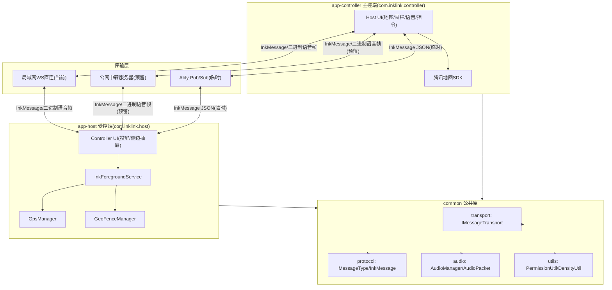

# InkLink 双端安卓软件技术设计

Feature Name: inklink-android-guide
Updated: 2026-08-29

## Description

InkLink 是纯 Kotlin 编写的安卓双端软件。受控端（手表/备用机）后台常驻提供投屏显示、GPS 采集、围栏监测、语音对讲；主控端（主力手机）提供地图查看、围栏编辑、指令下发、语音对讲、告警接收。本设计在保留原有局域网 WS 直连 + 公网中转预留架构的基础上，将 minSdk 下调至 23（Android 6.0），新增语音对讲模块、动态权限管理与全机型屏幕适配。

### 关键设计决策

| 决策项 | 方案 | 理由 |
|--------|------|------|
| 语音传输通道 | WebSocket 二进制帧（`ws.binary`） | 避免 Base64 膨胀 33%，降低传输体积与延迟 |
| 对讲模式 | 全双工实时通话 | 通话体验接近电话；回声经原生 `AcousticEchoCanceler` 消除，硬件不支持时自动禁用并提示 |
| 协议编号冲突修复 | `AUDIO_DATA` 改码为 7 → 重排为 10 | 原 `ALERT_EXIT(7)` 与 `AUDIO_DATA(7)` 冲突，必须修复 |
| 语音采样 | 8000Hz / 16bit / 单声道，20ms 分片 | 每包 320 字节，局域网低延迟、弱网低带宽 |
| 受控端网络角色 | WS Server（局域网），公网中转模式为 WS Client | 局域网免配置直连，公网统一连中转站 |
| 后台录音 | 前台服务 + Android 14 麦克风前台服务权限声明 | 满足不同 targetSdk 版本的后台录音合规要求 |
| 工程结构 | 三 Module：common + app-host + app-controller | 放弃 productFlavor 双包名，规避老旧 Gradle 版本坑；common 复用，腾讯地图仅进 app-controller，app-host 零地图 SDK |
| 4G-4G 临时中转 | Ably Pub/Sub 广播频道 + `targetDeviceId` 客户端过滤 | 甲骨文自建 WS 上线前的原型；只传文本 JSON，语音搁置，自建 WS 上线后整体移除 |
| 坐标系 | `CoordinateConverter` 做 WGS-84 ↔ GCJ-02 双向转换 | GPS 原生为 WGS-84，腾讯地图为 GCJ-02，展示前/下发前互转 |
| 多设备管理 | 主控端本地持久化设备列表，地图按 `fromDeviceId` 聚合 | 一台主控可绑定并同时查看多台受控端，围栏由各受控端独立维护 |

## Architecture



## Components and Interfaces

### 传输层（transport，common 双端共享）

- **接口 `IMessageTransport` + `TransportMode`**：`connect()`、`disconnect()`、`sendMessage(InkMessage)`、`sendAudio(ByteArray)`、`setListener(TransportListener)`。
- **`LocalWsTransport`**：app-host 侧启动局域网 WS Server（监听 8080），app-controller 侧为 WS Client 连接 host IP:8080；支持消息分发、接收回调、连接状态回调、心跳收发与断线检测。实现基于 Java-WebSocket（okhttp 无服务端能力，故双端统一用 Java-WebSocket）。
- **`ServerRelayTransport`**：公网中转实现，双端均主动连接服务器，指数退避重连 + 心跳。
- **`AblyRelayTransport`**：4G-4G 临时中转实现，基于 `io.ably:ably-android`，广播频道 + `targetDeviceId` 客户端过滤模拟点对点；仅收发文本 JSON，语音本期搁置。
- **`TransportManager`**：三模式切换隔离，切换先销毁旧实例再建新实例，切换期消息缓存重放。
- **`TransportListener`**：`onTextMessage(InkMessage)`、`onAudioMessage(ByteArray)`、`onConnectionChanged(Boolean)`。
- 局域网/公网模式对上层暴露同一接口，上层业务无感知。

### 消息协议（protocol，双端共享）

- **`MessageType`**（修复冲突后编号）：

```kotlin
enum class MessageType(val code: Int) {
    TEXT(1),            // 文本投屏
    IMAGE(2),           // 图片投屏
    GPS_REPORT(3),      // GPS位置上报
    CMD_CLEAR(4),       // 清屏指令
    GEOFENCE_CONFIG(5), // 下发围栏配置
    ALERT_ENTER(6),     // 进入区域告警
    ALERT_EXIT(7),      // 离开区域告警
    AUDIO_DATA(8),      // 语音二进制数据包
    AUDIO_START(9),     // 发起语音通话
    AUDIO_STOP(10),     // 结束语音通话
    HEARTBEAT(99)       // 心跳保活
}
```

- **`InkMessage`**：

```kotlin
data class InkMessage(
    val type: Int,
    val payload: String? = null,        // 文本/JSON类消息
    val audioData: ByteArray? = null,   // 语音二进制（仅 AUDIO_DATA 使用）
    val targetDeviceId: String? = null, // 目标设备（公网中转路由）
    val fromDeviceId: String? = null,
    val address: String? = null
)
```

- **文本帧编码**：`InkMessage` 序列化为 JSON 文本帧发送；`audioData` 字段在文本帧中恒为 null。
- **语音帧**：直接发送 WebSocket 二进制帧，帧头固定 1 字节 `MessageType`（=8），后续为 PCM 数据，降低解析开销。`AudioPacket` 负责封装与解包。

### 语音对讲模块（audio）

- **`AudioManager`（service.audio，受控端与主控端各自持有一份）**：
  - 采集：`AudioRecord`（8000Hz / ENCODING_PCM_16BIT / 单声道 / 缓冲 2×320B）。
  - 播放：`AudioTrack`（相同参数，MODE_STREAM），维护 jitter buffer（约 5 帧 = 100ms）吸收网络抖动。
  - 回声消除：优先启用原生 `AcousticEchoCanceler`（API 16+，`isAvailable()` 检测），硬件不支持时降级为仅降噪并提示用户佩戴耳机；可选叠加 `NoiseSuppressor`、`AutomaticGainControl`。
  - 静音检测：以 RMS 阈值判定（阈值 300/短时能量），静音帧不发送。
  - 状态机：`IDLE → CALLING → IDLE`，同一时间仅允许一路通话。
- **`AudioPacket`**：封装二进制帧的组装（header + PCM）与解析，含简单序号用于丢包检测（播放端检测到跳号则静音填充）。
- **全双工通话控制流**：
  1. 主控端按下通话按钮 → 发送 `AUDIO_START`。
  2. 受控端检查录音权限与空闲状态，同意则回发 `AUDIO_START`（确认）并同时启动采集与播放，拒绝则回发 `AUDIO_STOP`（拒绝原因）。
  3. 通话期间双方同时采集并发送 `AUDIO_DATA`，同时接收对端帧实时播放，收发互不阻塞。
  4. 任一方挂断 → 发送 `AUDIO_STOP`，双方释放 `AudioRecord`/`AudioTrack`/AEC 资源。

### GPS 与围栏（service.gps / service.geofence，受控端）

- `GpsDetector`：检测设备 GPS 硬件与定位权限是否可用，无 GPS 时直接停用模块。
- `GpsManager`：`FusedLocationProvider` 周期定位（默认 10s/距离 5m），`onLocationChanged` 组装 `GPS_REPORT` 发送。
- `GeoFence`：围栏数据模型（圆心经纬度、半径、动作）。
- `GeoFenceManager`：解析 `GEOFENCE_CONFIG` 的圆心/半径，基于当前坐标做距离计算（避免 Google Geofencing API 在部分国产设备不可用），进出边沿触发 `ALERT_ENTER`/`ALERT_EXIT`，带去抖（连续 2 次采样确认）防止抖动误报。

### 腾讯地图 SDK 集成（仅 app-controller，主控端）

- **引入范围**：仅 `app-controller` 集成腾讯矢量地图 SDK（`tencent-map-vector-sdk` + 基础库 `foundation`）；`app-host`（受控端）零地图 SDK，保持轻量化，GPS 采集仍用系统原生 `LocationManager`（`GpsManager`），不引入第三方定位 SDK。
- **鉴权三要素**：Key + 包名 + SHA1 三者严格匹配，错一个即鉴权失败（日志打印鉴权错误码）。
  - 包名：`com.inklink.controller`
  - Debug SHA1：`2D:4F:00:08:0C:B8:86:17:BF:7F:0A:8A:E2:AF:71:E0:9C:9A:46:22`
  - Release SHA1：`2E:60:B8:89:B0:6D:07:21:E9:0F:01:9B:2A:DE:0E:A7:89:7B:9B:AD`
  - Release 指纹取自统一签名 keystore（`keystore/inklink-release.keystore`，alias `inklink`），与 CI 签名、发布 APK 完全一致。
- **Key 配置**：`AndroidManifest.xml` 的 `<meta-data android:name="TencentMapSDK" android:value="..." />`；Key 需在腾讯位置服务控制台绑定上述包名 + Debug/Release 两套 SHA1，否则旧测试 Key 会鉴权 100 失败。
- **隐私合规**：`InkControllerApplication.onCreate()` 按顺序执行 `TencentMapInitializer.setAgreePrivacy(this, true)` → `TencentMapInitializer.start(this)`，任何地图初始化前必须完成。
- **权限**：`ACCESS_FINE_LOCATION` / `ACCESS_COARSE_LOCATION`（主控端地图定位本机位置）+ `INTERNET` + `WRITE_EXTERNAL_STORAGE`（maxSdk 28，瓦片缓存）。
- **混淆白名单**：`app-controller/proguard-rules.pro` 保留 `com.tencent.map.**` 与 `com.tencent.tencentmap.**`，release 开启 minify 后地图才不黑屏崩溃。
- **业务层接口不变**：地图渲染（`MapActivity`）、Marker 点位、围栏编辑（`FenceEditActivity`）仅替换底层 SDK 实现；`transport`/`protocol`/`InkMessage`/`GPS_REPORT`/`GeoFence` 数据模型完全不动。
- **坐标系**：腾讯地图采用 GCJ-02；`GpsManager` 上报为 WGS-84 原生坐标，展示/逆地理前经 `CoordinateConverter` 转换。`CoordinateConverter` 已实现 WGS-84 ↔ GCJ-02 双向转换（含中国境内判定），MapActivity 展示前 WGS-84 → GCJ-02，FenceEditActivity 下发前 GCJ-02 → WGS-84。
- **围栏计算位置**：仍由受控端本地 `GeoFenceManager` 判定，腾讯地图只负责 UI 展示，不做围栏运算。
- **逆地理编码【延后迭代】**：本期不引入 `tencent-map-search-sdk`，不实现省市区街道解析。`InkMessage.address` 协议字段保留（为未来公网版本预留，序列化/反序列化兼容），本期业务层不填充、UI 只展示经纬度点位。后续迭代再加 search-sdk 依赖与调用逻辑，避免前期增加包体积与鉴权报错风险。

### 前台服务（InkForegroundService，受控端）

- 启动即调用 `startForeground()` 展示常驻通知（`NOTIFICATION_CHANNEL` 低优先级）。
- 持有 `GpsManager`、`GeoFenceManager`、`AudioManager`，统一生命周期。
- 语音采集/播放完全在此服务内，Activity 销毁不中断。

### 权限与屏幕适配（utils）

- **`PermissionUtil`**：封装 `checkPermission`、`requestPermission(Activity, perm, callback)`、`onRequestPermissionsResult` 分发；维护各模块权限状态单例。
- **`DensityUtil`**：`dp2px`、`px2dp`、`getScreenWidth/Height`、`getDensity`；低分辨率检测（`min(w,h) < 480dp`）供投屏降采样使用。

## Data Models

```kotlin
// GPS 上报载荷（payload 为 JSON）
{"lat": 31.2304, "lng": 121.4737, "speed": 0.0, "time": 1724800000000}

// 围栏配置载荷（payload 为 JSON）
{"lat": 31.2304, "lng": 121.4737, "radius": 300, "action": "set"}

// 图片投屏载荷（payload 为 Base64 的降采样 JPEG）
// 文字投屏载荷（payload 为 UTF-8 字符串）

// 语音二进制帧
// [0]        : byte 8 (MessageType.AUDIO_DATA)
// [1..2]     : uint16 sequence
// [3..n]     : PCM 8000Hz/16bit 320 字节
```

## Correctness Properties

1. **单路通话不变式**：同一时刻双端至多存在一路通话；`AUDIO_START` 在 `CALLING` 态被拒绝。
2. **语音帧有序**：采集端按序号递增发送，播放端按序号缓冲；跳号缺失用静音补齐，不允许乱序播放造成音爆。
3. **权限降级不变式**：无录音权限 → 语音对讲隐藏且拒绝通话；无定位权限 → GPS/围栏关闭；其余功能始终可用。
4. **围栏去抖**：状态翻转需连续 2 次采样确认，避免 GPS 抖动触发重复告警。
5. **传输隔离**：文本消息与二进制语音帧在 WebSocket 上分通道（text/binary）发送，互不阻塞解析。
6. **协议编号唯一性**：`MessageType` 全部 code 唯一，修复原 `AUDIO_DATA(7)` 与 `ALERT_EXIT(7)` 冲突。

## Error Handling

| 场景 | 处理策略 |
|------|----------|
| 录音权限被拒绝 | 隐藏语音入口；收到 `AUDIO_START` 回发 `AUDIO_STOP`（reason=NO_PERMISSION） |
| 定位权限被拒绝 | 停止 GPS/围栏，UI 展示降级提示，其余功能正常 |
| 局域网 WS 断开 | 指数退避重连（1s→2s→4s→上限 30s），重连成功恢复业务 |
| 设备无回声消除硬件 | 检测 `AcousticEchoCanceler.isAvailable()` 为 false，降级为降噪并提示用户佩戴耳机，通话继续 |
| 语音包乱序/丢包 | 序号校验 + jitter buffer，丢包静音填充，不做重传（实时性优先） |
| 采集失败（AudioRecord 未初始化） | 捕获 `init` 异常，终止通话并回发 `AUDIO_STOP` |
| 低内存设备 | 投屏图片按 `min(w,h)<480dp` 降采样；前台服务捕获 `OOM` 降级释放图片缓存 |
| 休眠断连 | 心跳间隔自适应（亮屏 10s / 灭屏 30s），前台服务 + 白名单引导降低被杀概率 |

## Test Strategy

- **单元测试（JVM）**：`MessageType` 编号唯一性；`InkMessage` JSON 序列化/反序列化 round-trip；`AudioPacket` 组包/解包与序号校验；`DensityUtil` dp/px 互转；围栏进出判定与去抖逻辑。
- **协议一致性测试**：文本帧与二进制帧在同一 WebSocket 会话内的顺序解析。
- **设备矩阵测试**：Android 6.0（真机/模拟器）、8.0、12+、14+ 覆盖；手表（方形/圆形，低分辨率）与手机各一台。
- **语音专项**：局域网弱网（模拟丢包 5%/延迟 100ms）下通话可用性；静音检测是否在无语音时停止发包；挂断后资源是否释放（无泄漏，`AudioTrack` 正确 stop/release）。
- **权限专项**：拒绝定位/录音后对应功能降级；首次拒绝后再次授权即时生效。
- **集成冒烟**：双端连接 → 文字投屏 → 图片投屏 → 清屏 → GPS 轨迹 → 围栏进出告警 → 语音对讲全链路。

## Task List

可执行任务拆解见 `tasklist.md`（T0 工程骨架 → T10 Ably 中转 + 坐标转换 + 多设备管理，含预估工期与输出物）。

## 公网服务器中转（甲骨文 Ubuntu 适配）

### 设计原则

- 客户端代码零侵入：只补全 common 库内 `ServerRelayTransport` 实现，双端业务代码不改。
- Ubuntu 端部署极简 WebSocket 中转服务：双向消息透传转发，不做业务解析；服务器只路由，业务逻辑全在安卓双端。
- 双端均主动连接服务器，无需端口映射、无需暴露设备公网 IP。
- 局域网模式与公网模式共用同一 `InkMessage` 协议与 `IMessageTransport` 接口，模式切换上层无感知。

### 通信架构

- **局域网模式**：app-host 开 WS Server，app-controller 直连 host IP（原有逻辑不变）。
- **公网服务器模式**：app-host 与 app-controller 都主动外连甲骨文 Ubuntu WS 中转服务，服务器做消息路由转发。
- 消息协议完全复用 `InkMessage`，服务器只转发文本/二进制，不解包，性能开销极低。

### 设备寻址规则

服务器维护设备映射表 `deviceId(唯一标识) ↔ WebSocket连接`。消息中的 `targetDeviceId` / `fromDeviceId` 为设备唯一 ID，服务器据此转发。设备 ID 生成策略：

1. 优先读取 `Settings.Secure.ANDROID_ID`（无需权限，普通场景唯一且稳定）。
2. fallback：Android 6.0 恢复出厂会重置 `ANDROID_ID`；部分无 Google 服务的手表设备会返回固定相同值。检测到读取失败、为空、或与已知重复时，本地生成 UUID 并持久化到 `SharedPreferences` 作为设备 ID 兜底，保证重启后稳定。

### 服务器部署（Ubuntu 20.04/22.04，甲骨文免费机适配）

**1. 基础环境初始化**

```bash
sudo apt update && sudo apt upgrade -y

# 安装 Node.js（最简中转服务用 nodejs-ws，开发最快）
curl -fsSL https://deb.nodesource.com/setup_20.x | sudo -E bash -
sudo apt install nodejs -y

# 放行防火墙 WebSocket 端口（自定义，如 8081）
sudo ufw allow 8081/tcp
```

> 甲骨文控制台云安全组也必须放行 8081 端口，系统 ufw 与安全组双层缺一不可。

**2. 极简 WS 中转服务（server.js）**

```javascript
const WebSocket = require('ws');
const wss = new WebSocket.Server({ port: 8081 });

const deviceMap = new Map(); // deviceId -> WebSocket

wss.on('connection', (ws) => {
    // 当前连接转发目标（二进制帧无法解包取 targetDeviceId，需在连接上缓存）
    let currentTarget = null;

    ws.on('message', (data, isBinary) => {
        if (isBinary) {
            // 语音二进制帧：原样透传
            const target = deviceMap.get(currentTarget);
            if (target && target.readyState === WebSocket.OPEN) {
                target.send(data, { binary: true });
            }
            return;
        }
        const msg = JSON.parse(data.toString());
        // 幂等绑定：每条文本消息按 fromDeviceId 注册/刷新连接映射
        currentTarget = msg.targetDeviceId;
        const prev = deviceMap.get(msg.fromDeviceId);
        if (prev !== ws) deviceMap.set(msg.fromDeviceId, ws);
        // 定向转发
        if (msg.targetDeviceId) {
            const target = deviceMap.get(msg.targetDeviceId);
            if (target && target.readyState === WebSocket.OPEN) {
                target.send(data);
            }
        }
    });

    ws.on('close', () => {
        // 仅当映射仍指向当前连接时清理，避免误删新连接
        for (const [id, conn] of deviceMap.entries()) {
            if (conn === ws) deviceMap.delete(id);
        }
    });

    ws.on('error', (err) => console.error('连接错误:', err.message));
});
console.log('WS 中转服务启动，端口 8081');
```

> 设计要点：二进制帧按连接缓存的目标转发，避免语音包需解包；映射采用幂等 upsert，防止重连错绑。

**启动与常驻**

```bash
npm init -y
npm install ws
node server.js
```

后台常驻用 systemd 托管并开机自启；同时建议增加 Node 心跳探测定期清理僵尸连接，避免内存泄漏。

**3. 安全增强（生产环境必做）**

1. Nginx 做 WSS 加密转发（443 端口），配 Let's Encrypt 免费证书，将 `ws://` 转 `wss://`，降低运营商拦截概率。
2. Token 鉴权：连接时携带密钥，非法连接直接断开，防止服务器被滥用。
3. 心跳超时清理僵尸连接，避免服务器内存泄漏。

### 安卓客户端改造（只改 common 库，双端共用）

补全 `ServerRelayTransport.kt`（原空壳填充）。实现基于 Java-WebSocket（`org.java-websocket`）：
- `WebSocketClient` 连接服务器（okhttp 无服务端能力，为与 `LocalWsTransport` 的 Server 侧统一，双端均用 Java-WebSocket）。
- `onOpen` 上报自身 `deviceId`（HEARTBEAT 消息）完成服务器映射注册。
- `onMessage(String)` 解析 `InkMessage` JSON → `onTextMessage`；`onMessage(ByteBuffer)` 原样 → `onAudioMessage`。
- 指数退避重连 + 周期心跳，可选关闭证书校验（自用测试）。

> 完整实现见 `common/src/main/java/com/inklink/common/transport/ServerRelayTransport.kt`。与 `LocalWsTransport` 实现同构：文本帧 → `InkMessage` JSON，二进制帧 → `onAudioMessage`，上层双端业务零改动。

**双端适配改动点**

1. app-host：生成唯一 deviceId，启动时连接 Ubuntu 服务器，等待主控端下发指令。
2. app-controller：输入受控端 deviceId 即可定向发送消息，地图、围栏、语音、投屏业务逻辑完全不变。
3. 设置页增加服务器地址输入框、设备 ID 填写框，模式一键切换局域网/服务器中转。

### 甲骨文 Ubuntu 专属坑点

1. 默认防火墙 + 云安全组双层拦截：必须同时放开系统 ufw 端口 + 甲骨文网页控制台安全组端口，否则外网连不上。
2. 免费机空闲休眠策略：配置 systemd 服务 + 保活心跳，防止空闲回收/断开 WS 连接。
3. Android 6.0 支持标准 CA 证书（TLS 1.2），生产直接用 Let's Encrypt 正规 WSS 证书；忽略证书校验仅限自用测试环境，并标注安全风险，不作为默认方案。
4. 语音对讲二进制数据由服务器原样透传，不需要处理音频格式；延迟只取决于服务器带宽，甲骨文免费机带宽足够家用。

### 已确认风险点与对策

**风险 1：Android 6.0 的 `ANDROID_ID` 不可靠**

- 现象：恢复出厂会重置 `ANDROID_ID`；部分无 Google 服务的手表设备返回固定相同值。
- 对策：设备 ID 采用 `ANDROID_ID` 优先 + fallback 策略——读取失败/为空/疑似重复时，本地生成 UUID 并持久化到 `SharedPreferences`，保证重启后稳定。封装为 `DeviceIdProvider` 供双端共用。

**风险 2：甲骨文免费实例空闲休眠 / CPU 节流**

- 现象：长时间无流量会出现 CPU 限流、网络抖动。
- 对策：
  - server.js 侧：增加服务端主动心跳 `ping`，对僵尸连接超时（如 60s 无响应）主动 `close` 清理，防止连接堆积。
  - Android `ServerRelayTransport` 侧：重连采用指数退避（1s→2s→4s→…→上限 60s，可配 jitter），避免服务器抖动时客户端疯狂重连打满服务器。

**风险 3：WSS 证书与 Android 6.0 兼容性**

- 现象：Android 6.0 系统根证书库较旧，Let's Encrypt 新版证书可能存在兼容性问题。
- 对策（写为可配置项）：
  - 自用调试：允许配置关闭证书校验（仅自用测试，不对外分发），代码中独立开关并加注释警告。
  - 正式部署：Nginx 配置兼容旧安卓的证书链（如部署完整中间证书链），优先保证 Android 6.0 可正常握手；关闭证书校验开关在生产构建默认置 false。

**风险 4：双模式切换状态隔离**

- 现象：从「公网中转」切回「局域网模式」时，若未销毁 `ServerRelayTransport` 的 WebSocket，会残留双连接同时收发消息，造成消息乱序。
- 对策：模式切换时统一走 `TransportManager` 的 `switchMode(mode)`，先 `disconnect()` 销毁旧实例（关闭 WS、置空 listener、取消重连定时器），再创建新实例；切换期间消息缓存到切换完成后重放，保证不丢不乱。

### 开发顺序调整

原有 T0-T8 完全不动，T9 追加服务器适配（详见 `tasklist.md`）：

T9 公网服务器适配 + 发布：甲骨文 Ubuntu 部署 WS 中转服务 → 实现 `ServerRelayTransport` → 双端公网联调（语音/定位/投屏跨外网传输）→ 打包发布两个 APK，内置服务器地址配置项。

### 最终架构优势

1. 前期开发完全用局域网，不依赖服务器，开发效率不受影响。
2. 后期部署甲骨文 Ubuntu 只新增一个传输实现类，原有业务代码一行不改。
3. 受控端依旧轻量化，不依赖外网也能本地运行，联网自动切换公网模式。
4. 服务器只做透传、逻辑极简、稳定性高，甲骨文免费套餐完全支撑个人家用场景。

## Ably 中转（4G-4G 临时原型）

### 设计原则

- 独立于局域网/公网服务器两模式，作为第三传输模式 `TransportMode.ABLY`，上层业务零感知。
- 仅面向 4G-4G 无局域网、且自建 WS 中转尚未上线的过渡场景；自建 WS 上线后整体移除。
- 本期只传文本/JSON 消息，语音二进制搁置（Ably 二进制承载与低延迟调优成本高，非原型目标）。

### 通信架构

- 双端用 `io.ably:ably-android:1.2.52` 订阅同一频道 `inklink-proto-ch01`，事件名 `ink-message`。
- 频道为广播语义：任一设备发布消息，所有在线设备都会收到。`AblyRelayTransport` 在接收端按 `targetDeviceId` 客户端过滤——仅当 `targetDeviceId` 为空或等于本机 `deviceId` 时投递到上层。
- `InkMessage` 序列化为 JSON 文本作为 Ably 消息 data；`audioData`/二进制帧本期不承载。

### Key 配置

- Ably Root Key 不硬编码进源码，经 `local.properties` 的 `ABLY_KEY` → 两端 `build.gradle.kts` 注入 `BuildConfig.ABLY_KEY`。
- SDK 仅需 Root Key 即可连接，无需额外 JWT/Token 服务。
- 接入注意：`ConnectionState` 枚举归属 `io.ably.lib.realtime.ConnectionState`（非 `io.ably.lib.types.ConnectionState`）。

### 安卓客户端改造

- `AblyRelayTransport` 实现 `IMessageTransport`：`connect()` 建立 Ably 连接并订阅频道，`sendMessage` 将 `InkMessage` JSON 发布到频道，`disconnect()` 退订并释放连接。
- `TransportManager.switchMode(ABLY, ablyKey)` 先销毁旧实例再建新实例，沿用缓存重放策略。
- 受控端与主控端共用同一实现，仅通过 `targetDeviceId`/`fromDeviceId` 定向。

### 已确认风险点

**风险 1：广播频道消息泄露**

- 现象：Ably 频道广播语义下，第三方若拿到频道名与 Key 可订阅到所有消息。
- 对策：作为临时原型接受；生产切自建 WS 中转时用 Token 鉴权 + 定向路由替代。

**风险 2：Ably 依赖体积与包名混淆**

- 对策：混淆白名单补 `io.ably.**`；语音二进制不在本期承载，降低调试复杂度。

## 主控端多设备管理

### 设计原则

- 一台主控可绑定多台受控端，本地持久化设备列表（deviceId + 备注）。
- 地图同时展示所有在线受控端位置；告警按 `fromDeviceId` 归属到对应设备。
- 围栏仍由各受控端本地 `GeoFenceManager` 独立维护，主控端只负责选中目标并下发。

### 数据与状态

- `DeviceEntity(deviceId, nickname)`：设备条目，昵称用于区分多台受控端。
- `DeviceRepository`：SharedPreferences（`inklink_devices`）+ JSON 列表持久化，提供增删改查。
- `ControllerState` 扩展：
  - `gpsByDevice: Map<String, GpsReport>`：按 `fromDeviceId` 聚合最新位置。
  - `selectedDeviceId`：当前定向目标。
  - `isOnline(deviceId)`：以 60s 阈值判定在线状态。

### 关键实现

- `InkControllerApplication`：GPS/告警消息按 `fromDeviceId` 路由到 `gpsByDevice`；提供设备 CRUD、`selectDevice`、`connectAbly`。
- `DeviceManageActivity`：设备列表、添加（输入 deviceId + 备注）、删除、重命名、点选目标。
- `MapActivity`：遍历 `gpsByDevice` 绘制多 Marker，颜色按 deviceId 哈希分配，优先聚焦选中设备。
- `FenceEditActivity`：以选中设备最新位置为初始中心；未选中目标时禁止下发围栏。
- 受控端 `InkForegroundService`：仅主控端指令类消息（TEXT/IMAGE/CMD_CLEAR/GEOFENCE_CONFIG/AUDIO_START/AUDIO_STOP）更新 `defaultTargetDeviceId`，避免多受控端 GPS/告警广播互相覆盖定向目标。

### 已确认风险点

**风险 1：多受控端广播串扰**

- 现象：Ably 广播下，A 受控端上报的 GPS 会携带 `fromDeviceId=A` 被 B 受控端收到，若 B 据此更新定向目标会错乱。
- 对策：受控端仅响应主控端指令类消息更新 `defaultTargetDeviceId`；GPS/告警等来自其他受控端的消息不改变定向目标。

## References

[^1]: (Website) - [Android 运行时权限官方文档](https://developer.android.com/guide/topics/permissions/overview)
[^2]: (Website) - [AudioRecord 官方文档](https://developer.android.com/reference/android/media/AudioRecord)
[^3]: (Website) - [腾讯位置服务 Android 地图 SDK](https://lbs.qq.com/mobile/androidMapSDK/androidMapGuide)
[^4]: (Website) - [ws 库官方文档](https://github.com/websockets/ws)
