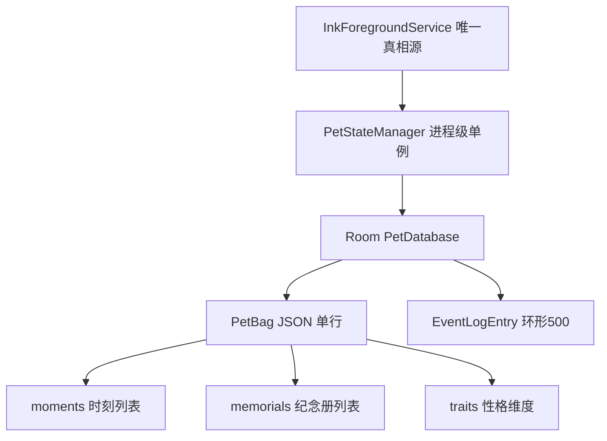
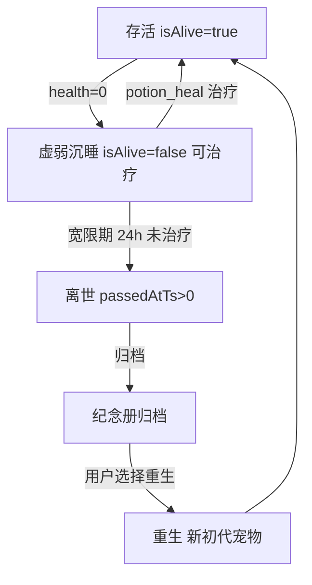

# 陪伴体系深化 技术设计（pet-companionship）

Feature Name: pet-companionship
Updated: 2026-09-05

## Description

在 V1.1「功能齐全」基础上，分三阶段补齐情感记忆、亲子闭环、玩法深化与健壮性。九项功能全部以「零破坏」为第一纪律：业务层/状态机/数据库/协议仅在必要处**追加**，老存档兼容。

## 核心设计决策

1. **零 schema 变更**：`PetDatabase` 采用 `fallbackToDestructiveMigration()`（加表会清空老数据，对情感记忆功能致命）。因此所有新增持久化数据（时刻、纪念册、性格维度、备份元数据）一律写入 `PetBag` 的 JSON 字段，随现有 `upsertBag` 单行落盘，Gson 向后兼容（新字段带默认值，旧档读取走默认）。
2. **真相源不变**：新增逻辑全部挂在 `PetStateManager`（进程级单例）+ `InkForegroundService` 事件流，UI 仅订阅。
3. **协议零新增码位优先**：亲子闭环复用 `REMOTE_TASK_ACK(46)`、`PET_STATE_SYNC(30)`、`PET_REMOTE_GIFT(44)` 现有通道；仅当语义不满足时才追加码位（追加从 53 起，避免与既有 50/51/52 冲突）。

## 总体架构



新增持久化数据全部挂 `PetBag` JSON，不新增 Room 表。

---

## 阶段一 · 情感记忆（详细设计）

### R1 成长时间线 / 相册

**数据模型**：`PetBag` 追加 `moments: MutableList<Moment>`。

```kotlin
data class Moment(
    val momentId: String,      // UUID
    val petId: String,         // 关联宠物
    val type: String,          // HATCH/ADULT/FORM/REVIVE/GIFT/MILESTONE...
    val title: String,         // 高光标题
    val ts: Long,              // 时间戳
    val snapshot: String = ""  // 可选：生成时刻的摘要文案
)
```

**组件与接口**：`PetStateManager` 新增
- `recordMoment(type, title)`：从事件日志写入流程中筛出"高光"类型，同步落一条 `Moment`。
- `listMoments(petId): List<Moment>`：时间倒序。

**触发点**：现有 `insertLog` 的调用处（孵化/升级/形态/康复/收礼/里程碑）统一走 `recordMoment`，凡命中高光类型集合 `{HATCH, LEVEL_UP, FORM, REVIVE, GIFT, MILESTONE}` 即沉淀一条时刻。时刻独立于事件日志 500 条环形淘汰。

**正确性**：
- 时刻数量上限 `MAX_MOMENTS = 2000`，超出裁最旧（防 JSON 单行膨胀）。
- 时刻一旦写入不随宠物离世删除（见 R2 归档）。

**UI**：`PetMainActivity` 新增「成长时间线」入口，列表倒序展示时刻；主控端 `PetDetailActivity` 同样可看。

### R2 生命闭环（死亡 → 告别 → 重生）

**状态机**：



**数据模型**：
- `PetItem` 追加 `passedAtTs: Long = 0`（离世时间戳，0=未离世）、`lastHealthZeroTs: Long = 0`（最后一次 health 归零时间，用于宽限期计时）。
- `PetBag` 追加 `memorials: MutableList<Memorial>`。

```kotlin
data class Memorial(
    val memorialId: String,          // UUID
    val name: String,                // 离世宠物名
    val petType: String,             // 物种
    val birthTs: Long,               // 孵化时间
    val passedTs: Long,              // 离世时间
    val lifespanMs: Long,            // 寿命
    val finalForm: String,           // 成年形态
    val traits: Map<String, Int>,    // 性格画像（阶段三落地后填充）
    val momentCount: Int             // 关联时刻数
)
```

**组件与接口**：`PetStateManager` 新增
- `checkLifeClosure(now)`：在 `recalculateState`/`settle` 后调用，检测 `!isAlive && passedAtTs==0 && now - lastHealthZeroTs > GRACE_MS`，命中则置 `passedAtTs=now`，并 `archiveMemorial()`。
- `archiveMemorial()`：生成 `Memorial`，把该宠物的 `moments` 归档为不可再编辑（只读），宠物保留在 `petList` 供纪念册展示（或移入独立列表，实现时定）。
- `rebirth()`：生成全新 `PetItem`（新 `petId`、成长归零、继承物种），清空 `moments` 关联新宠物，`memorials` 保留。

**常量**：`GRACE_MS = 24h`（宽限期，`PetClock` 增加或本地常量）。

**正确性**：
- 宽限期计时基于墙钟时间差，复用 `lastUpdateTs` 幂等机制；离世判定幂等（`passedAtTs>0` 后不再重复归档）。
- 重生不继承金币/装饰/道具（已拍板）；仅 `memorials` 保留。
- 离世宠物不参与双时钟结算（`isAlive=false` 分支已存在，扩展为跳过离世）。

---

## 阶段二 · 亲子闭环

### R3 任务 → 宠物奖励闭环

**设计**：受控端在 `REMOTE_TASK_ACK(46)` 判定任务 `PLAYED` 的同一处，触发 `PetStateManager.onTaskCompleted(taskId)` 发放奖励。奖励档位存 `PetBag` 新增 `taskReward: MutableMap<String, TaskRewardRule>`（taskId 或通配默认档）。

```kotlin
data class TaskRewardRule(
    val coin: Int = 0,
    val itemId: String = "",   // 空=无道具
    val itemCount: Int = 0,
    val growthExp: Int = 0     // 直接成长值
)
```

**正确性**：任务幂等——`taskId` 记入 `rewardedTaskIds: MutableSet<String>`，重复 `PLAYED` 回执不重复发奖。奖励发放走既有 `addReward()` 统一入账。

### R4 陪伴透明化（家长端互动时间线）

**设计**：受控端互动（feed/play/clean/learn/sleep/tease）已写 `EventLogEntry`。新增轻量上报：复用 `PET_STATE_SYNC(30)` 通道追加 `careEvents` 字段（类型+计数），或独立走离线队列增量同步。主控端 `PetDetailActivity` 按天聚合展示。

**正确性**：离线互动进入既有离线队列（上限 50），联网后按时间戳正序补传；单日无互动在家长端提示。

### R5 合影 / 分享卡片

**设计**：纯 UI。`PetSpriteView` 增加 `renderToBitmap(): Bitmap`（将当前绘制逻辑输出到离屏 Canvas），合成像素背景 + 宠物 + 边框，经 `MediaStore` 写入相册，分享走系统 `ACTION_SEND`。无业务层改动。

**正确性**：无相册权限时降级为分享面板直发；`renderToBitmap` 复用现有绘制管线，保证与屏幕所见一致。

---

## 阶段三 · 玩法深化 + 健壮性

### R6 多维性格

**数据模型**：`PetItem` 追加 `traits: MutableMap<String, Int> = mutableMapOf()`（键：gluttony/timidness/nocturnal/cleanliness，值 [-100,100]）。保留现有 `playfulness/affection`（兼容）。

**设计**：创建宠物时按物种倾向生成初始 traits；互动正负向调整；`PetAiEngine` 行为树选择与台词按 traits 加权。

### R7 时间感（生日 / 节日 / 季节）

**设计**：`PetItem.birthTs` 已有。生日=满月/满年触发奖励；节日皮肤/季节场景走 `PetCatalog` 配置表 + 系统日期判定，复用 `sceneId`/`skinId` 字段。无新持久化。

### R8 多宠物并存

**设计**：`petList` 已支持多宠物。场景渲染改为遍历存活宠物共同展示；宠物间互动写事件日志。UI 层改动为主。

### R9 数据备份 / 迁移

**设计**：`PetStateManager.exportBackup(): String` 将 `PetBag`（含 moments/memorials/traits）+ 事件日志序列化为一个版本化 JSON 文件（`schemaVer` 递增），经系统文件选择器保存；`importBackup(json)` 校验版本与格式后整体还原。

**正确性**：备份文件不合法/版本不兼容 → 拒绝并提示，不破坏现有数据（先解析校验、再原子替换）。导出前经家长端 PIN 或确认弹窗（儿童隐私）。

---

## Data Models 汇总

| 变更 | 位置 | 类型 |
|------|------|------|
| `moments` | PetBag | `MutableList<Moment>` |
| `memorials` | PetBag | `MutableList<Memorial>` |
| `traits` | PetItem | `MutableMap<String, Int>` |
| `passedAtTs` / `lastHealthZeroTs` | PetItem | `Long` |
| `taskReward` / `rewardedTaskIds` | PetBag | `Map` / `Set` |
| `schemaVer` 递增 | PetBag | `Int` |

全部字段带默认值，Gson 向后兼容，零 Room schema 变更。

## Correctness Properties

1. 时刻/纪念册写入与事件日志写入同事务语义（节流写库窗口内），不因崩溃半写。
2. 离世判定幂等：`passedAtTs>0` 后不再重复归档、不再结算。
3. 重生不继承资产，仅保留纪念册；`rewardedTaskIds` 防重复发奖。
4. 备份导入先校验后替换，失败零副作用。

## Error Handling

- 宽限期未到不误判离世（墙钟时间差 + 幂等）。
- 备份文件损坏/版本不符 → 明确提示并保留现有数据。
- 合影无权限 → 降级分享面板。
- 奖励规则缺省 → 走默认档，不发空奖。

## Test Strategy

- `PetDecayEngineTest` 扩展：离世宽限期计时、离世后不结算、幂等归档。
- 新增 `PetLifeLoopTest`：状态机 ALIVE→WEAK→PASSED→MEMORIAL→REBORN 全路径；重生资产不继承。
- 新增 `PetMomentTest`：高光筛选、`MAX_MOMENTS` 裁剪、归档只读。
- 新增 `PetTaskRewardTest`：PLAYED 发奖、RECEIVED 不发、taskId 幂等。
- 新增 `PetBackupTest`：导出→导入往返、坏文件拒绝、版本不兼容拒绝。
- 协议回环：复用 `PetProtocolRoundTripTest` 思路，若新增码位则补足。

## References

[^1]: `.monkeycode/specs/pet-system/design.md` — V1.1 终稿（唯一真相源/协议码位/数值规则）
[^2]: `app-host/src/main/java/com/inklink/host/data/PetDatabase.kt` — Room 单例、`fallbackToDestructiveMigration`
[^3]: `app-host/src/main/java/com/inklink/host/data/PetEntities.kt` — `PetBagRow`/`EventLogEntry`
[^4]: `common/src/main/java/com/inklink/common/protocol/payload/PetPayloads.kt` — `PetItem`/`PetBag` 字段全集
[^5]: `app-host/src/main/java/com/inklink/host/state/PetDecayEngine.kt` — 双时钟结算（离世判定挂载点）
