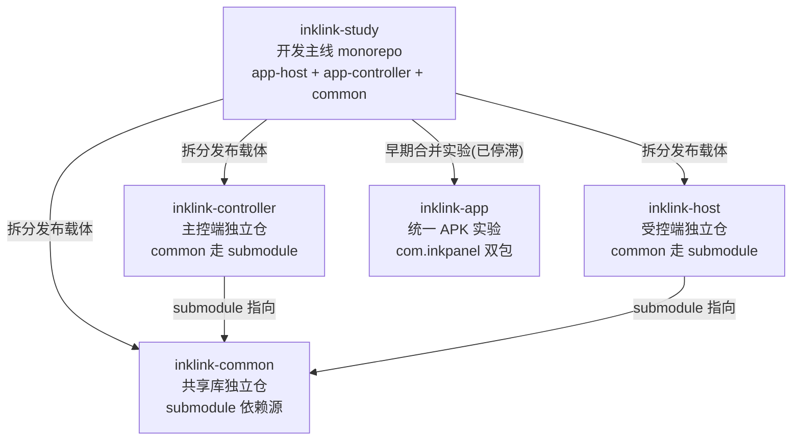

# InkLink 仓库关联总览

本文档说明 InkLink 生态中各仓库的定位、关联机制与同步状态。开发主线在 `inklink-study`（本仓库），其余仓库为发布载体或早期实验。

## 仓库拓扑

> 注：mermaid 图中「拆分发布载体」表示方向性关系——study 是代码源头，拆分仓承载签名构建与产物发布。

## 各仓库定位与状态

| 仓库 | 角色 | CI 产物 | 最后活跃 | 功能代际 |
|------|------|---------|----------|----------|
| [inklink-study](https://github.com/caogenfunan123/inklink-study)（master） | **开发主线**：三模块 monorepo，全功能（宠物系统、学习乐园、历史轨迹、强控指令、围栏） | Release APK（v1.2.0-N，已接入统一签名 keystore） | 持续开发 | 最新 |
| [inklink-common](https://github.com/caogenfunan123/inklink-common)（main） | 共享库独立仓：协议、GPS、围栏、传输、音频，供 controller/host 以 submodule 引入 | 无 | 2026-08-29 | 停在早期（协议 52+29 码位时代） |
| [inklink-controller](https://github.com/caogenfunan123/inklink-controller)（main） | 主控端拆分仓：`app-controller/` + `common/` submodule | Artifact APK（**已签名**，keystore 入库） | 2026-08-29 | 早期（聊天/地图/Ably/围栏，无宠物/学习/轨迹落盘） |
| [inklink-host](https://github.com/caogenfunan123/inklink-host)（main） | 受控端拆分仓：`app-host/` + `common/` submodule | Artifact APK（已签名） | 2026-08-29 | 早期 |
| [inklink-app](https://github.com/caogenfunan123/inklink-app)（main） | 最早的统一 APK 实验：`com.inkpanel.slave` + `com.inkpanel.master` 双包合体 | Artifact | 停滞 | 前代（InkPanel 代号时代） |

## 关联机制

### 1. 代码血缘

- `inklink-study` 是唯一开发主线，全部新功能（电子宠物、学习乐园、历史轨迹落盘、围栏可视化、强控指令）先落在 study。
- `inklink-common` / `inklink-controller` / `inklink-host` 是 2026-08-28 从 study 拆出的发布载体：common 抽为独立仓库，controller/host 以 Git submodule 引入（`git submodule update --init --recursive`）。
- 拆分仓的 common submodule 指向 `inklink-common@09a3e81`（2026-08-29），**落后于 study 的 common**（study 此后新增宠物协议 30-49 码位、学习乐园、GpsReport 增强、Ably 稳定性等）。

### 2. 签名共享（双端覆盖安装的基础）

- 签名 keystore：`keystore/inklink-release.keystore`（RSA 2048，alias `inklink`，有效期至 2054），**在 inklink-controller 仓库入库**，study 与 host 仓共享同一份（见各仓 SIGNING 引用）。
- SHA256 指纹：`D9:D9:3C:FC:FA:39:F8:EB:5E:D9:C0:D2:B6:14:E0:8A:56:50:A0:CA:66:BC:4C:91:7D:54:11:67:28:0E:04:41`
- 两端 App 使用同一签名 → 可互相覆盖安装并共享签名级权限。腾讯地图控制台登记此 keystore 的 SHA1 即可让 CI 产物地图可用。
- 签名配置：`signingConfigs.release` 从环境变量（`INKLINK_KEYSTORE_PATH` / `INKLINK_STORE_PASSWORD` / `INKLINK_KEY_ALIAS` / `INKLINK_KEY_PASSWORD`）或 `local.properties`（`inklinkStoreFile` / `inklinkStorePassword` / `inklinkKeyAlias` / `inklinkKeyPassword`）读取。

### 3. CI 构建对照

| 仓库 | workflow | 触发 | 产物 | 签名 |
|------|----------|------|------|------|
| inklink-study | `.github/workflows/android.yml` | push master | GitHub Release（v1.2.0-N 双端 APK）+ 双模块单测门禁 | 已签名（secrets：`INKLINK_STORE_PASSWORD` 等，2026-09-27 接入） |
| inklink-controller | `.github/workflows/build.yml` | push main | Artifact `inklink-controller-release` | 已签名（secrets：`INKLINK_STORE_PASSWORD` 等） |

## 同步状态矩阵（study 主线 → 拆分仓）

| 功能 | study | controller 拆分仓 |
|------|-------|-------------------|
| 基础地图/轨迹/路线规划 | 最新 | 早期版可用 |
| 双端聊天（文/图/语音） | 最新 | 早期版可用 |
| 电子宠物系统（30-49 码位） | 有 | 无 |
| 学习乐园（40-47 码位） | 有 | 无 |
| 历史轨迹按天落盘/回放/GPX 导出 | 有（2026-09-27） | 无 |
| 围栏可视化 + 告警通知直达 | 有（2026-09-27） | 无（仅基础围栏下发） |
| 强控指令（响铃/推送告警/深度刷新） | 有 | 无 |
| Release 签名 | 已接入（同一 keystore） | 已具备 |

## 与旧仓库（study）建立关联的操作指引

1. **同步 common**：study 的 `common/` 有变更后，需将其推到 `inklink-common` 仓库（`git subtree push` 或手工镜像），再在 controller/host 仓更新 submodule 指针。
2. **同步功能代码**：controller/host 拆分仓追平 study 对应模块时，按模块目录整体对照移植，协议码位以 `common/.../MessageType.kt` 为准（只增不改）。
3. **签名一致性**：study 与拆分仓使用同一 keystore 时，包名相同的 APK（`com.inklink.controller` / `com.inklink.host`）可互相覆盖安装；更换 keystore 会导致无法覆盖安装，需先卸载。
4. **发版口径**：对外发布以 study 的 GitHub Release（v1.2.0-N）为准；拆分仓 Artifact 仅用于快速验证。
